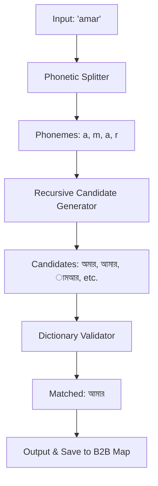

# Project Architecture: Banglish-to-Bangla Converter

This document outlines the technical design and logic flow of the Banglish-to-Bangla transliteration engine.

## 1. The Conversion Pipeline

The conversion process follows a three-stage pipeline: **Phonetic Splitting** -> **Recursive Generation** -> **Dictionary Validation**.

## 2. Core Components

### A. Phonetic Splitter
The splitter uses a "longest-match" algorithm. It compares the input string against all keys in the `banGenerator.csv` (sorted by length). This ensures that multi-character phonemes like `kh` are detected before single characters like `k`.

### B. Recursive Candidate Generator
Since a single English letter can map to multiple Bangla characters (e.g., 'a' -> 'া', 'অ', 'আ'), the generator explores these possibilities. It builds a tree of all potential Bangla spellings for a given Banglish word.

### C. Dictionary Validator
To prevent the generation of "gibberish" words, the engine performs a set-based lookup against four large Bengali word lists. This ensures that the output is always a real, existing word in the Bengali language.

### D. Automated Learning (B2B Map)
When a valid conversion is found, the system appends the mapping to `ben2bn.csv`. This creates a fast-path cache, allowing subsequent lookups for the same word to bypass the expensive generation logic.

## 3. Data Structures
- **Generator Map**: A dictionary where keys are English phonemes and values are lists of Bangla options.
- **Word Lists**: Loaded as Python `set` objects to provide O(1) time complexity for validations.
